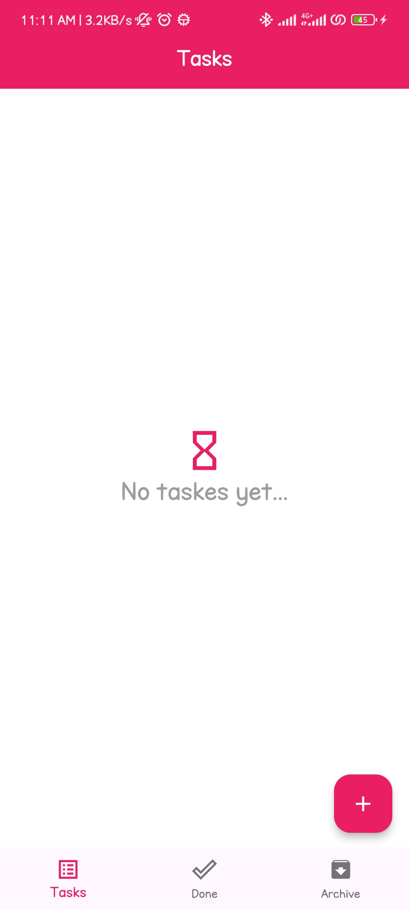
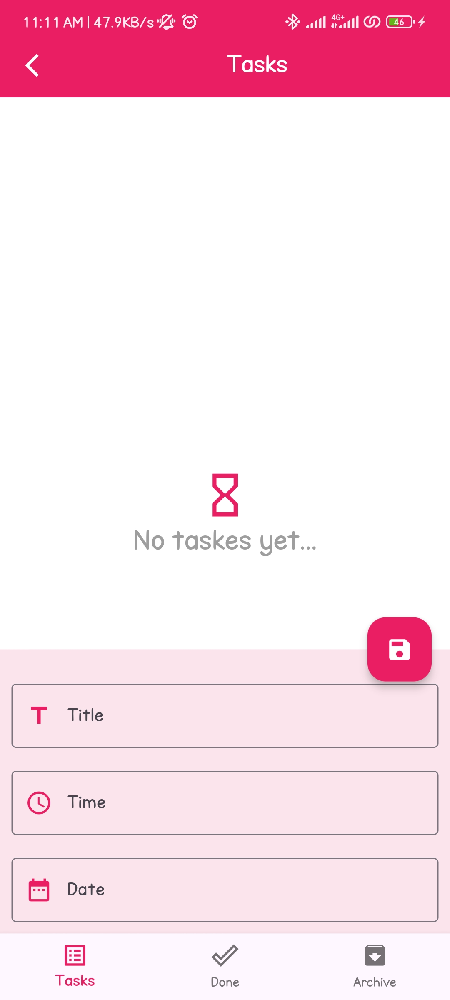
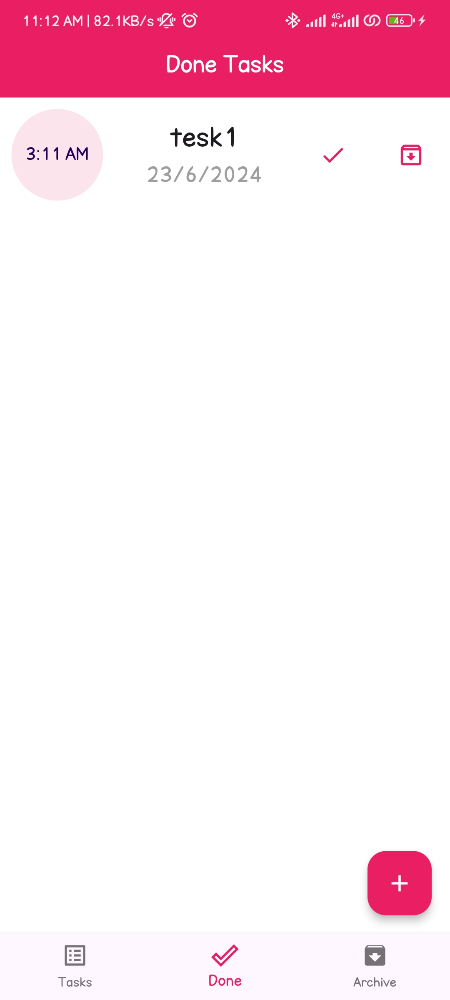
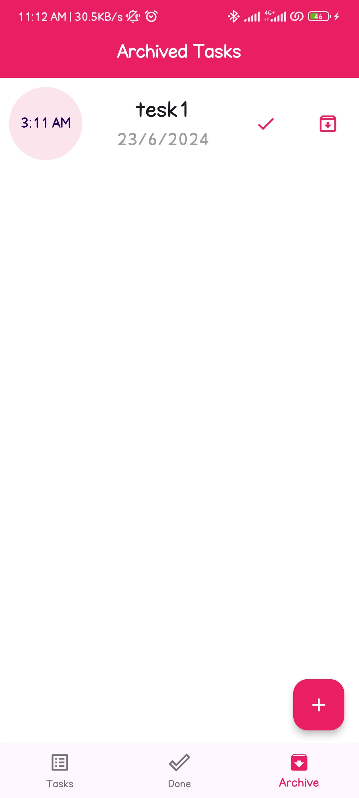

# Todo App

A **simple yet powerful Todo app** built with **Flutter** and **Bloc** for state management. This app allows users to efficiently manage tasks by categorizing them into **New Tasks**, **Done Tasks**, and **Archived Tasks** with persistent storage using **SQLite**.

## 🚀 Features

- ✅ **Add New Tasks** with a title, time, and date.
- 📌 **Categorize Tasks** into **New**, **Done**, or **Archived**.
- 🔄 **Update Task Status** (Mark as Done or Archive).
- 🗄 **Persistent Storage** with **SQLite**.
- 🎨 **Clean UI** and **Responsive Design**.

## 📸 Screenshots

| Home Screen | New Tasks | Done Tasks | Archived Tasks |
|------------|----------|-----------|---------------|
|  |  |  |  |

## 🛠 Installation & Setup

### Prerequisites

Ensure you have the following installed:
- [Flutter SDK](https://flutter.dev/docs/get-started/install)
- [Dart SDK](https://dart.dev/get-dart)

### 📥 Clone the Repository
```sh
git clone https://github.com/yourusername/todo_app.git
cd todo_app
```

### 📦 Install Dependencies
```sh
flutter pub get
```

### ▶️ Run the App
1. Connect your device or start an emulator.
2. Run the following command:
```sh
flutter run
```

## 📂 Project Structure

```plaintext
lib/
├── layout/
│   ├── home_layout.dart       # Main layout of the app
│
├── modules/
│   ├── new_tasks/
│   │   ├── new_tasks_screen.dart   # Screen for new tasks
│   ├── done_tasks/
│   │   ├── done_tasks_screen.dart  # Screen for completed tasks
│   ├── archived_tasks/
│       ├── archived_tasks_screen.dart  # Screen for archived tasks
│
├── shared/
│   ├── cubit/
│   │   ├── cubit.dart          # Bloc Cubit for state management
│   │   ├── states.dart         # Bloc States
│   ├── components/
│       ├── components.dart     # Reusable UI components
│
├── main.dart                   # Entry point of the app
```

## 📦 Dependencies

This project uses the following Flutter packages:

| Package | Description |
|---------|-------------|
| [`flutter_bloc`](https://pub.dev/packages/flutter_bloc) | State management using BLoC pattern |
| [`intl`](https://pub.dev/packages/intl) | Date formatting support |
| [`sqflite`](https://pub.dev/packages/sqflite) | SQLite database integration |

## 👥 Contributing

Contributions are **welcome**! If you’d like to contribute:

1. Fork the repository.
2. Create a new branch (`git checkout -b feature-branch`).
3. Make your changes and commit (`git commit -m 'Add new feature'`).
4. Push to the branch (`git push origin feature-branch`).
5. Open a **Pull Request**.

## 📜 License

This project is licensed under the **MIT License**. See the [LICENSE](LICENSE) file for details.

---

🌟 **Enjoy using the Todo App! If you like it, give it a ⭐ on GitHub!**

